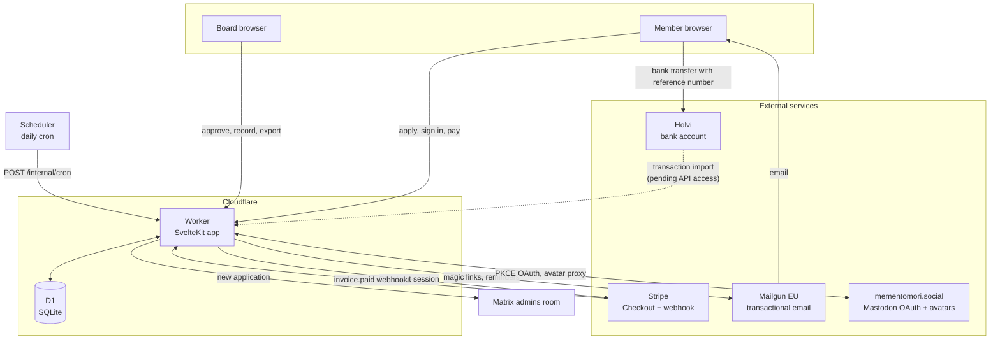

# Architecture

Membership site of Mementomori ry, the registered non-profit that runs [mementomori.social](https://mementomori.social).

## Stack

- [SvelteKit](https://svelte.dev/docs/kit) ([GitHub](https://github.com/sveltejs/kit)) on [Cloudflare Workers](https://developers.cloudflare.com/workers/), via [@sveltejs/adapter-cloudflare](https://svelte.dev/docs/kit/adapter-cloudflare)
- [Cloudflare D1](https://developers.cloudflare.com/d1/) with [Drizzle ORM](https://orm.drizzle.team) ([GitHub](https://github.com/drizzle-team/drizzle-orm))
- [Better Auth](https://better-auth.com) ([GitHub](https://github.com/better-auth/better-auth)) for magic links and OAuth
- [Paraglide](https://inlang.com/m/gerre34r/library-inlang-paraglideJs) ([GitHub](https://github.com/opral/inlang-paraglide-js)) for i18n
- [Stripe](https://stripe.com) ([GitHub](https://github.com/stripe/stripe-node)) for card payments
- [Mailgun](https://www.mailgun.com) for transactional email, EU region
- [Mastodon](https://joinmastodon.org) ([GitHub](https://github.com/mastodon/mastodon)) as the OAuth provider, our own instance

## Infrastructure

Every arrow into the Worker is authenticated: sessions for members and the board, a signed webhook for Stripe, a bearer token for the cron endpoint, PKCE and state cookies for OAuth.

## Why this stack

The association's entire yearly budget is about 2 450 €, nearly all of it already committed to the Hetzner server that runs mementomori.social. That constraint decided most of these choices.

### Cloudflare Workers instead of a server

Running this next to Mastodon on the existing Hetzner box would have been free in money but expensive in risk: a bug or a traffic spike on the membership app could take down the social media platform the association exists to run. A separate platform is a separate failure domain. Workers also costs nothing at this scale and has no operating system to patch.

### D1 instead of Postgres

A managed Postgres instance is a recurring bill, and a self-hosted one is another service to back up and upgrade. The dataset here is a few hundred members and their payments, which SQLite handles without effort. D1 lives next to the Worker, so there is no connection pool to tune and no network hop.

### Stripe instead of a Finnish payment provider

Stripe has no monthly fee, handles recurring subscriptions natively, and pays out to a normal Finnish IBAN. Providers with monthly minimums are hard to justify when the association's income is expected to be a few hundred euros a year at the start. Bank transfers with Finnish reference numbers exist alongside cards precisely so that nobody is forced through Stripe.

### Our own Mastodon as the identity provider

Most prospective members already have an account on mementomori.social. Letting them prove that with OAuth removes a password and prefills the application. Mastodon does not release email addresses, so the form still asks for one, and OAuth verifies and links the account rather than creating it.

### Building rather than buying

A hosted membership service would add a recurring fee to a budget that has no room for one, and the requirements here are specific: sign-in with our own Mastodon instance, two fixed fee tiers set by the association meeting, Finnish reference-number matching for bank transfers, a member register that satisfies yhdistyslaki 11 §, and a two-approver rule for board decisions. Self-hosting the membership data also matches the association's stated purpose in its rules: promoting digitally sovereign, European social media.

## Authentication

No passwords. Two ways in:

- **Mastodon OAuth** against mementomori.social, using PKCE and the `profile` scope. Mastodon does not expose email addresses, so OAuth verifies the account and prefills the name. The application form still collects name, home municipality and email. The verified account is linked at creation and used for subsequent sign-ins.
- **Magic links.** The form path stores the application without a login and emails a sign-in link (Better Auth magicLink plugin, Mailgun HTTP API). The application row is claimed by verified email on first dashboard visit.

## Membership flow

An application creates a `member` row with status `applied`. The board approves it: two distinct board members, at least one of them chair or vice chair, and nobody may approve their own application. Approvals are recorded in the `approval` table. Only then does the status become `approved`.

## Payments

All payments land in the `payment` ledger:

- **Stripe Checkout** subscriptions using fixed price ids from the environment. The webhook at `/webhooks/stripe` verifies signatures and writes one ledger row per paid invoice, idempotent on the invoice id.
- **Bank transfers.** Each approved member gets a unique Finnish reference number (viitenumero, 7-3-1 check digit). The daily job imports bank transactions when Holvi API access is configured and matches them to members by reference. Until then the board records transfers in the admin view.

## Automation

New applications are announced in the board's Matrix room using the same bot that relays Mastodon signups and reports, so the board sees them where it already works.

`POST /internal/cron`, protected by a bearer token, runs the daily jobs: bank transaction import, payment reminders to bank payers (subscribers renew on their own), and an overdue summary to the board. Memberships are never terminated automatically, because ending one is a board decision under the association's rules.

## Tables

Better Auth owns `user`, `session`, `account` and `verification`. The domain tables are `member` (the statutory member register), `approval` and `payment`. Migrations live in `drizzle/` and are applied with `wrangler d1 migrations apply`.

## Security

Content Security Policy with per-request nonces, security headers set in the server hook, external images served only through same-origin proxy routes with host allowlists, and httpOnly cookies for OAuth state and PKCE verifiers. See `src/hooks.server.ts`.

## Internationalisation

Messages live in `messages/en.json` and `messages/fi.json` and are compiled by Paraglide. English is served at the root and Finnish under `/fi`, with a cookie fallback and browser language detection on first visit. The language switcher is a native select that scales to any number of locales.
